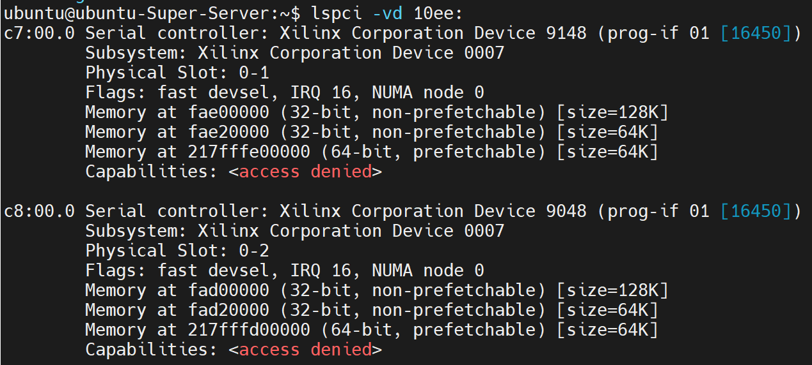

# IoC_X86_5.15_v1.01
## 1. HW Setup
Currently we deply our X86 test environmet in VMs. Host is connected to our **CXL SWICTH**, which currently is deployed on FPGA.
(1) programming the **CXL SWITCH** firmware into FPGA (we use U280 to test) using **Vivado**, then reboot the host.
(2) Verify the SWICTH firmware is loaded correctly

```lspci -vd 10ee:  ```

You should be able to see two PCIe endpoints like:


## 2. SW Setup
### (1) Create VMs
Install **virt-manager** using:

```sudo apt install virt-manager```

Using **virt-manager** to create 2 VMs of ubuntu20.04 Desktop, you can download the ISO file from [here](https://www.releases.ubuntu.com/focal/)

### (2) Setup virt-manager
Suppose the two VMs are called **VM0** and **VM1** now and after. Respectively edit VM xml file, add such description in ***device*** tag to pass the EP through to **VM0** and **VM1**. In HW setup, we already have 2 PCIe EPs, **EP0** and **EP1**. Suppose **EP0** is on domain 0 , bus 7, slot 0 and function 0, to pass **EP0** throught to **VM0**, we should add such descption to **VM0**'s xml file.
```
<hostdev mode='subsystem' type='pci' managed='yes'>
       <driver name='vfio'/>
       <source>
         <address domain='0x0000' bus='0x07' slot='0x00' function='0x0'/>
       </source>
</hostdev>
```
Please modify the ***domain***, ***bus***, ***slot*** and ***function*** accordingly.
### (3) Install driver
On **VM0** and **VM1**, install the driver:

``` make ``` 

``` sudo insmod nupanet.ko``` 


### (4) Network Interface Settings
After installing driver succcessfully, you should be able to see a new ethernet interface called **enpMsN** when you run **ifconfig** command , M and N may be different in different environmrnts. Now we can set IP and gateway for NUPA-NET Interface.Suppose we are on ubuntu 20.04 Desktop, after we insmod nupanet.ko, goto ***settings->network***, On **VM0** and **VM1**, respectively config ethernet interface as shown in the next picture:

make sure to set the IP of ****VM0** and **VM1** different and in the same subnet.

## 3. Test
After setting up the nupanet, we can run some basic tests to test nupanet 
### (1) ping test
Suppose **VM0**'s IP is ```192.168.8.100``` and **VM1**'s IP is ```192.168.8.101```, on **VM0**, we can ping **VM1** using:

``` ping 192.168.8.101``` 


### (2) socket test
After ping test is successful, we can basically be sure that the link between **VM0** and **VM1** is ok. Now we can perform socket test. In test directory, we have prepared simple socket test programs,***server*** and ***client***. Suppose **VM0** (192.168.8.100) is the server, and **VM1** (192.168.8.102)is the client. On **VM0**, run:

``` ./server -p 9999 ```

On **VM1**, run:

``` ./client -p 9999 -i 192.168.8.100```

Now **VM0** and **VM1** can talk to each other using ***server*** and ***client***.

### (3) iperf test
After socket test is over, we can use ***iperf*** test to test performance. Suppose **VM0** is server(192.168.8.100), and **VM1**(192.168.8.101) is client.
On **VM0**, run:

``` iperf3 -s```

On **VM1**, run:

``` iperf3 -c 192.168.8.100 -i 1 -t 10```